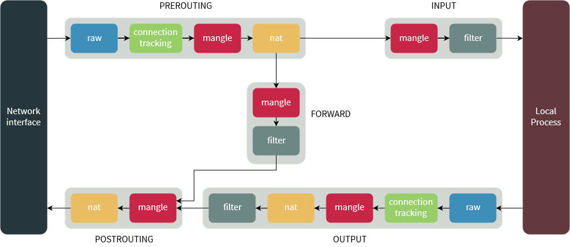

# Iptables

- first match rule: chain traversing stop at first match

## Tables

See the tables:
- filter: `iptables -n filter -L -v`
- nat: `iptables -n nat -L -v`
- mangle: `iptables -n mangle -L -v`
- raw: `iptables -n raw -L -v`

## Flow

- NAT can alter the routing decision for an incoming packet (FORWARD chain or INPUT chain?)

## The NAT Table

### SNAT and MASQUERADE
The SNAT target requires you to give it an IP address to apply to all the outgoing packets. The MASQUERADE target lets you give it an interface, and whatever address is on that interface is the address that is applied to all the outgoing packets. In addition, with SNAT, the kernel's connection tracking keeps track of all the connections when the interface is taken down and brought back up; the same is not true for the MASQUERADE target.

## Docker
https://medium.com/@havloujian.joachim/advanced-docker-networking-outgoing-ip-921fc3090b09